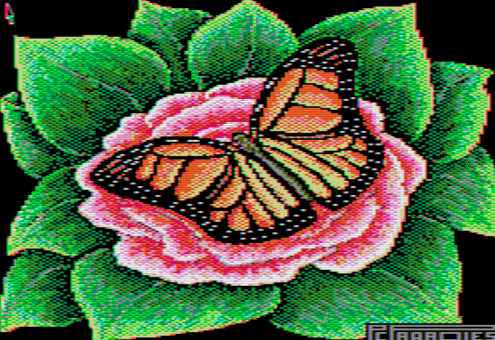
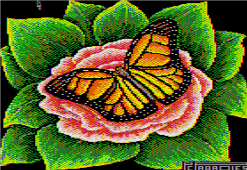

   

# MII Version Changelog
## 1.95
This is an intermediate release, mostly to fix a few bugs and add a few features that were requested.
 * Now have support for *writing* both DSK (PO and DO) as well as NIB files. As it
   turns out, this was a most requested feature -- I thought everyone would be
    happy with WOZ files, but no, people want to write DSK files. So now you can.
 * Quite a few tweaks and a couple bug fixes were provided by Frédérick @skippyfr for the core 65c02 emulation, thanks!
 * Quite a few code changes on the way I dealt with ROM files; removed the use
   of *incbin.h* as it was creating problems with the linker, and failed to work
   with webassembly.
 * Added a *non-functional* proto support for Apple //c -- it half boots at the
   moment. Still need work, mostly changing my Disk ][ driver to properly emulate
   an IWM, but that'll come.
 * Changed the SmartPort driver to continue booting if there are no Disks. This
   seems to solve a problem people had with booting from a floppy when there was
    no hard drive -- MII would stop at the basic prompt; not it continues to boot
    from the next slot down the line (with a message).
 * Audio processing was redone. There is now a notion of an audio 'sink' with an (now 32 bit float) FIFO. The speaker code (and soon, perhaps, the mockingboard) writes to it's own sink, and there an audio mixer that reads from all the sinks and mixes them together. This allows for a more flexible audio system, and also allows for a 'master volume' control.
 * Also now use 'sokol_audio' for the audio output, which gives me the possibility of a multi-platform audio output, if ever needed. I also added support for "miniaudio"; but it does a bit too much for my need at the minute, and slows down the compilation considerably, so it's not the default.

## 1.9
#### Video
 * Video driver now only draw when the apple II video *really* changes. It keeps track of touched lines across the screen, and only updates when needed. This saves a considerable amount of CPU time.
 * Redid the monochrome video rendering, low-res, double low-res and dhires
   now have luminance based on the color, and not just a fixed value. This
    makes the monochrome rendering a lot more accurate (and attractive).

 * Added 2 other RGB color palettes, an alternate NTSC and the Mega2 (apple IIgs) one.

| NTSC Palette                         | Mega2 Palette                        |
|--------------------------------------|--------------------------------------|
|      |    |
|--------------------------------------|--------------------------------------|
 * Added AVX/SSE/generic vectorial versions of some code paths, for speed.
 * Added some more 'artifacts' color frindges to the HIRES rendering as well.

   

#### Other bits
 * Fixed a bug in the floppy stepper motor code that was preventing some floppies (demos, but also some prodos disks) from booting.
 * Reworked the SmartPort code a bit, should be more compatible with some prodos programs. Also fixed a crash in block reading code.
* Joystick can now be plugged after starting the emulator, it will be detected.
* Changed the way the 65c02 core emulator is interfaced to the rest of the emulation. It was made to be 'pretty' but was also quite suboptimal, so I made it a bit less pretty, but it is now easily twice as fast as before.
* While before the emulator was using perhaps 25% of a core on my current machine, now it uses about 9% CPU for the same task.
* The 'floppy' and 'hard drive' file selector dialog now has a small popup menu with the last few directory used, so you can quickly switch between them.
* Added support for 'pasting' text in the emulator. Paste your pet BASIC programs, it works now. (Control-SHIFT-V -- not in a menu yet).
* There is a non-functional Mockingboard driver in the code, it's not hooked up to the UI, it still needs work (mostly make the audio output work).
* UI library got a massive overhaul, since it was released separately it had to get a serious cleanup. Some files are duplicated unfortunately, but that is needed to be able to use it as a standalone library.

## 1.8
 * Changed the floppy disk view. *It now rotates*, and the heat map is now a
   'trail' of the head, showing where it's been. It looks awesome!

  

<i>Poor quality gif, It is a LOT smoother at 60fps in the program!</i>

 * Added support for a *Ramworks III card*, with 1MB of RAM. It could have more,
   but I thought and extra whole friggin MEGABYTE was enough for anyone.
 * Added support for flashing text in text mode. I know, it was a bit of a
   glaring omission, but it's there now.
 * Internal changes to the UI, I've split the whole codebase into a few more files,
   split the 'XORG/GLX' code from the 'Pure GL' code from the 'MII UI' code, so it should be a lot easier to port to other platforms.
 * Redid the *DHRES rendering*, it's now a lot more accurate, has the correct
   artifacts. It's not as optimized as the previous version, but it looks better.
 * Now remap the *joystick* coodinates to a 'square' -- my current 8bitdo joystick
    has a circular deadzone, and it was a bit annoying to use. I might make that
    a setting, but for now, it's hardwired.
 * *Emulator now passes a2audit*. There is only one kludge to do it, regarding the
 'phantom read' of the indirect addressing.
 * *Working Super Serial Card Driver*, it can bridge to a Linux /dev device for the moment, or to
   a 'fake' loopback device. IN#x and PR#x works, and I can bootstrap using
   ADTPro. It's all in there so I can run Mastodon!

  

<i>Super Serial Card config dialog</i>

### libmui
 * Standard file picker now shows *floppy icons*.
 * Added a *Color Apple Menu*, in pure Macintosh II style.

  

 * Fixed a few minor memory leaks.
 * Tons more stuff in libmui, inc new font styles (bold, underline, condensed). There is also a text edit control now (still prototype).

### Internals
 * Made an architecture document, see [Compiling](docs/Compiling.md) for a top-down view.
 * Ported the support for VCD (Value Change Dump) from simavr, so I can now
   record and playback the whole simulation of the floppy driver. No real use for the user.
 * Split the video rendering into bits with a 'main' line rendering function pointer that is set only when video mode changes. This is a bit faster, and that gets rid of the Giant Function.

## 1.7
 * New animated about box, because, everyone loves a good about box.
 * Added support for Write Protect of floppy disks; disk can be write protected manually, or if the file lacks write permissions, OR if the file format (NIB, DSK) doesn't support writes.
 * New fancypants 'bit view' of the floppy are they are read/written, with a
   heat map to show where the head was last. Drive 1 appears left of the screen,
   drive 2 on the right. It fades out after the drive motor stops.

  

<i>DOS 3.3 Disk 'bitstream view' on the left, the green trace shows what's just be read.</i>

## 1.6
 * Another big update, yanked the old DiskII driver, and replaced it with a
   homebrew one, low level, with native support for WOZ (1 & 2) files (*read AND write!*) as well as NIB and DSK (read only).
 * This is big news, and MII can now boot all kind of copy protected disks, in
   fact I tried a few hundreds, and they all worked so far!
 * There is currently no way to create a new disk, but you can use a tool like
   [CiderPress](https://a2ciderpress.com/) to create them, and then use them in MII. Or just copy your DOS 3.3.woz file and reformat it!
 * There were a few other minor changes, mostly added some timing measurement
   tooling, and a couple of (necessary for disk to work) tweaks to the emulator
   itself as it was not counting cycles correctly for a couple of instructions.
 * The UI now has support for pure power-of-two textures, for really old OpenGL
   implementations, it is turned off by default, but could work with some
   old hardware. Also updated *libmui* to make it less linux-centric.
 * Fixed some more color issues, mostly DHIRES.
 * Added 'typeahead' for when you select files in the dialog, like on old Macs
## 1.5
 * BIG update, loads of changes, fixes, improvements.
 * New super UI, using home-made libmui, channeling both GS/OS and MacOS 7.x!
 * New emulation fixes, way more accurate. Video redone, audio redone.
 * New front-end program using XLib and OpenGL 'low level'.
 * New Icon.
## 1.0
 * Fixed a few graphics rendering bugs/color swapped
 * Fixed a few Makefile issues involving pathnamed with 'spaces' in them.
 * More tweaks to the emulation, added a few cycles here and there.
 ## 0.9
 * Added a 'debugger' shell, accessible via telnet.
 * Added a mini-assembler, used to compile the drivers and the CPU unit tests.
 * Added a 'Titan Accelerator IIe' simulation, to turn on/off fast mode.
## 0.5
 * Initial release
